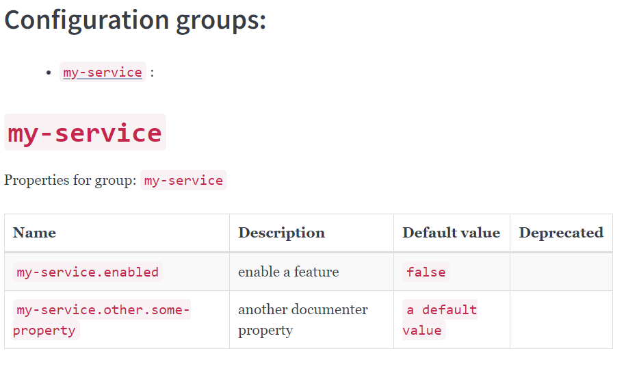

# jbang-catalog

Catalog of jbang scripts

## Spring Boot Property Documenter

A simple script to export your `META-INF/spring-configuration-metadata.json` files into a more
human-readable format.

### Pre-requisites

- Spring Boot's [typesafe configuration properties](https://docs.spring.io/spring-boot/docs/current/reference/html/features.html#features.external-config.typesafe-configuration-properties) should be enabled, with some javadocs.
- Spring Boot's [`spring-boot-configuration-processor`](https://docs.spring.io/spring-boot/docs/current/reference/html/configuration-metadata.html#appendix.configuration-metadata.annotation-processor) should be enabled. 
- Compile your project using `maven` or `gradle`

### Usage

```bash cd intro
# cd into your project root and compile sources with `maven` ou `gradle`
jbang springPropertyDocumenter@mikomatic -o generated-docs.md
```

The default output is in `markdown` format, but some options are available.

```shell
❯ jbang springPropertyDocumenter@mikomatic -h        
Usage: springPropertyDocumenter [-hV] -o=<output> [-t=<templateFile>]
                                [-m=<metadataLocationFolders>]...
Document spring boot properties based on property metadata
  -h, --help              Show this help message and exit.
  -m, --metadata-location-folders=<metadataLocationFolders>
                          Folder(s) containing spring boot configuration
                            metadata files (defaults to current folder)
  -o, --output=<output>   Markdown file output filename
  -t, --template=<templateFile>
                          an optional mustache template
  -V, --version           Print version information and exit.
```

- `-m`, `--metadata-location-folders`: provides folders containing spring boot configuration
  metadata files (defaults to current folder)
- `-t`, `--template`: provides a [`mustache`](https://mustache.github.io/) template file if you want to customize
  the output, instead of the default one.
  This could be useful if you want to export you documentation in another format (`asciidoc`, `html` ...).
- `-o`, `--output`: the exported filename

Result should look like this (_with your favorite markdown editor_):


